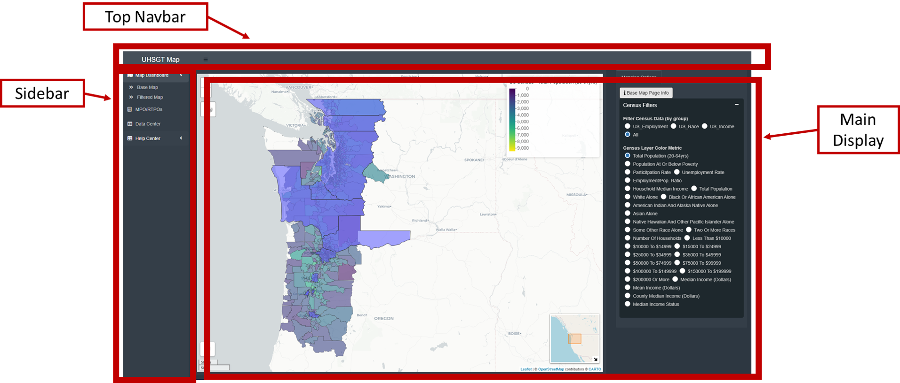
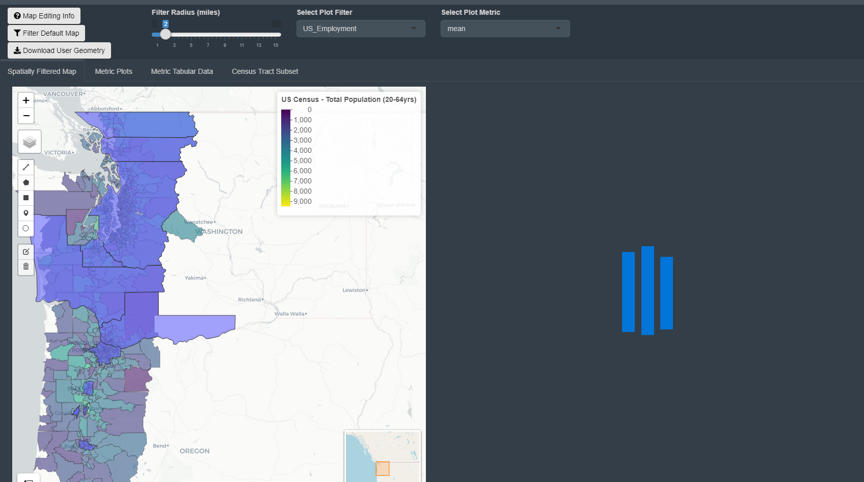

```{r setup, include=FALSE}
knitr::opts_chunk$set(echo = TRUE)
```

# Overview
The Ultra High Speed Ground Transportation (UHSGT) Planning Dashboard is a tool to investigate the Eugene, OR to Vancouver, British Columbia corridor as it pertains to the planning and development if UGSGT in the Pacific Northwest (PNW). No data or geographic information system (GIS) skills are required to use this dashboard. This dashboard brings together a multitude of shape files representing a variety of government jurisdictions and existing transportation infrastructure which populate the corridor - allowing the user to inspect spatial connections between different features and retrieve statistics immediately. This tool also provides the ability for users to define their own geometries and investigate how those new features interact with existing layers and boundaries. 

The dashboard was built using R and Shiny. GeocodR was created as part of the ASIL Initiatives by Michael Gaunt (Data Scientist, Seattle) with review by Nicholas Richter (Lead System Analyst, Seattle). 


# User Manual
This document stands to serve as an operation manual on how to use and navigate the dashboard. In addition to this document, the dashboard also contains a number of information buttons that can be clicked on that provide information about a particular page or dashboard functionality.

## Dashboard Navigation
The dashboard use-interface (UI) is composed of three sections - the top header bar, the left sidebar, and the main display. 



Top Header Bar

* This bar is intentionally bare
* It contains the title of the dashboard and a menu-icon (three stacked bars)
* Clicking on the menu-icon will collapse the left sidebars - resulting in a wider main display 

Left Sidebar

* As mentioned above the sidebar can be collapsed to make more room for the main display
  + The sidebar can still be used to navigate the site when collapsed 
* The left sidebar contains the links to different pages on the dashboard
  + Map Dashboard is the default page and contains two sub-pages 
    + The Base Map page displays the base map and map input controls on the right sidebar
    + The Filtered Map page contains all of the features that allow for user-defined geometry, map sub-setting, and metric aggregation
  + MPO RTPO page contains information pertaining to US MPOs
    + In particular, this page details when specific planning documents will be redrafted and published by the MPOs 
    + These documents are the Comprehensive Economic Development Strategy (CEDS), Regional Transportation Plan (RTP), and the Transportation Improvement Program (TIP)
  + The Data Center page contains tables detailing the layers used for the base map
  + The Help Center does not link to a new page but help and information buttons
  
Main Display

* All clickable page links (except "Help Center") on the left sidebar  will take the user to new display page 
* The main displays are made of containers that hold/show maps, plots, buttons, or inputs that the user can interact with

## Dashboard Pages
This section describes in more detail the different pages of the dashboard and their functionality. 

### Base Map 
This page displays the base corridor map and it's census inputs. 

The default map displays a multitude of layers depicting jurisdictional boundaries and important transportation features located along corridor. The extent of the base map reaches from Eugene, Oregon to Vancouver, British Columbia and from the Pacific Ocean to the Cascades. Many of the map layers extents were much larger but were buffered this way to limit computational load and to narrow the region for planning efforts. As implied earlier, the map contains layers for British Columbia, Washington, and Oregon - not all states or regions have the same type of data or types of layers available to them. This was a result of data being available for certain regions and not others as well as differences in data between the US and CA.

The map is interactive and can be manipulated using your cursor - the user can perform zoom and pan operations by clicking on the map and rolling their mouse wheel or drag the map,m respectively. Layers can be hidden or displayed by clicking on layers contained in the map layer icon in the upper left-hand corner of the map. The default displayed layers are US MPO RTPOs and US Census tracts - the US Census layer's name will change depending on what US Census metric is being used to color scale census tracts - default metric for the US Census is Total Population. The metric used to color US Census tract polygons can be changed by interacting with the Census Filters sidebar drop-down to the right of the main display. Filter Census Data (by group) changes/limits the available Census Layer Color Metric options and Census Layer Color Metric is the input that will change the UC Census layer color scale.

### Filtered Map 
This page enables the user to define new geometries to use to spatially filter the default corridor map. The subset returns all layers and features that it overlaps with and removes all layers that it has no interaction with. Metrics for the remaining census tracts are aggregated and returned to the user both visually in a series of plots and in tabular form. The subset aggregates can be compared to the corridor level aggregates to investigate how user defined spatial subset deviates from the corridor as a whole. For example, a user might be interested in equity and a specific demographic's representation for a potential Right-of-Way (ROW). The user draws a line on the map representing the proposed ROW, all relevant layer and map features are returned to the user once they initiate the subset process. They can then investigate their question regarding equity with respect to the proposed ROW. The user-defined features and resulting aggregated data can be downloaded - these processes are described below. 

This page is composed of two containers - the top input container and the lower tab box. The top input container houses buttons and inputs that the user can use to define and initiate the map sub-setting and metric aggregation process. The tab box contains a number of tabs that house the sub-setting features and the resulting maps, plots, and tables. 



#### Page Description

* Top Input Container 
  + Contains the buttons used to filter map and download shapefile
  + Displays the inputs to change the buffer applied to the user's geometry and selector for variables to show the box plots
* Spatially Filtered Maps
  + This is the default tab for the tab box
  + This tab Displays two maps - the left is editable and the right displays those edits and returns buffered corridor map
    + The buffered map will not load until the process has been initiated by the user
* Metric Plots
  + This tab displays plotted aggregated metrics based on the geometries defined by the user geometries and the resulting subsetted corridor
  + The top plot displays the Percent Difference between the corridor and corridor subset for all US Census variables
    + The user can choose which metric is displayed resulting from the aggregation process
      + The median, mean, min, max, or standard deviation of the aggregated metrics - mean is the default implying the values are the average of the metrics for the subset census tracts and the corridor census tracts
    + E.g. 100*(mean(Subset_Metric)-mean(Corridor_Metric))/mean(Corridor_Metric)
    + Green indicates that the subset aggregate is larger than the corridor level aggregate (does not imply "being better" than)
    + Both of these plots are interactive 
      + The user can hover-over features with the tool-tip to display more information
      + The user can zoom in on plot features using the zoom controls
      + The user can take pictures of the plots and save them using the camera feature
  + The bottom plot displays the same data but in box-plot form
    + The box plots indicate the central tendency and spread of the US Census metrics over the corridor and subsetted census tracts
    + Like above, this plot is also fully interactive
* Metric Tabular Data
  + This tab displays the same information as the above plots do but in tabular form
  + The data in this table can be  downloaded using the buttons located on the top of the table
* Census Tract Subset
  + This tab contains a table detailing which census tracts were selected by the subset 
  + The data in this table can also be downloaded and should be downloaded along with the tabular metrics above

#### Subset Process Description 

* The user defines a new geometry - polygons, lines, points, etc - using the left toolbar on the left hand map (see Spatially Filtered Maps tab)
* The user defines a buffer (default 1 mile) to be applied to their geometry (see top Navbar) 
* The user submits their selections and initiates the filtering and aggregation process by clicking the <strong>Filter Default Map</strong> button (see Navbar above)
* The user defined features and the resulting subset will be displayed on the right hand map (see) 
* US Census metrics (corridor and subsets) are displayed on the Subset Plots and Subset Data tabs
* The user has the option to download their geometry by pressing the <strong>Download User Geometry</strong> button (see Navbar above)


### MPO/RTPO Map 
This page contains infromation about the regional agencies responsible for tranpostrtion planning along the corridor. In the US, regional transportaion planning is pefromed by metropolitan planning organizations (MPO) or regional transportion planning orgainizations (RTPO) - these organizations are federally mandated and federally funded and are inplace to esnsure regional cooperation with regards to transportion planning. This layer of governance directs and allocates investements for tranprotaion projects, establish shared vision and goals for the future of the redion, and act as a conduit that faccilliate collaboration betweeen residents, interested parties, and other levels of govenerment both at the federal, state, and local levels. In acting in the capacity stated above, regional transporation planners produce a number of publications which detail both short-range project funding and long-range transportaaion palnning - documents are the Transporation Imporvement Program (TIP) and the Regional Transporation Plan (RTP), respectively. These documents are important cornerstones in the foundation of regional planning and tracking these documents, their content, and when they are to be renewed will be vitally important to XXXXXXXXXXXXXXXX

The page details re


### Data Center 
This page allows the user to examine and retreive the data contained in the base map. This page contains two tables - the left hand table contains information on all the layers which are currnetly included in the base map and the right hand table details the information contained in each layer. All layers have been previously processed in order to remove superflous information, clean or reconstruct data of poor quality, spatially buffer to limit the original extent of the data, or two combine similar data that were retreived from sepeate sources. Links are provided to the data's original source as well as features that allow the user to download the processed data. 

Default Map Data Layers table

+ Contains information for all layers in base map
+ Contains notes on the data layer - enabled by user click
+ Contains links to the original data source - enabled by user click
+ Clicking on a singular data layer will select that layer to be displayed in the righhand table
+ The contents of this table can be downloaded or copied by using the buttons at the top of the table

Raw Data for Selected Layer

+ Displays the data for the layer selected via user row selection of the left hand table
+ Displays all the information for selected layer that is shown in the base map 
+ The contents of this table can be downloaded or copied by using the buttons at the top of the table


### Help Center
Selecting this menu item will not generate a new diaplay window but will two buttons directly below in the sidebar menu. These buttons redisplay the into-modal seen when the page first loads and takes you to this document.

## Sharing this Dashboard
This dashboard's main intent is to enable UHSGT planners to xxxxxxxxxxxxxxxxxxx such that they can identify stakeholders at the corridor level early in the planning process. This dashboard was not meant to be public facing product or made for the use by the general public. Users who have been granted access to this dashboard should ask for permission before sharing this with others. Please contact your WSDOT repersentative. 


## General Use


